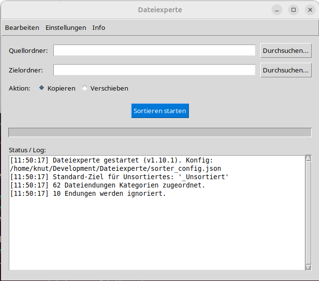
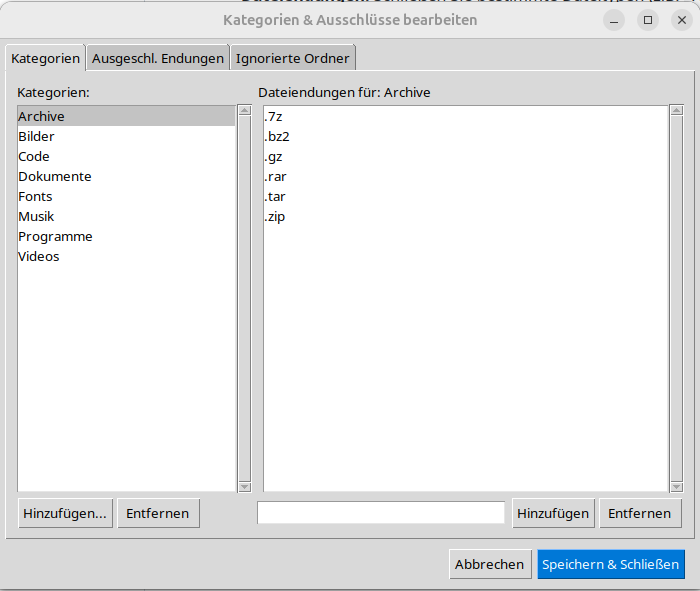
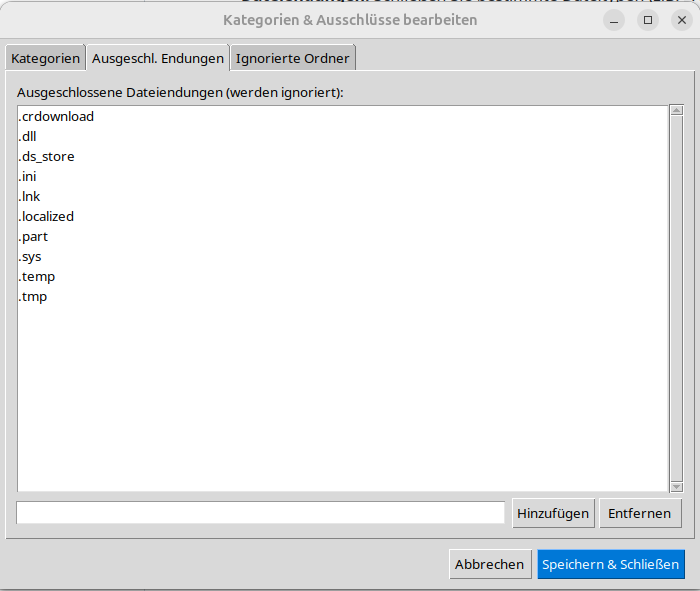
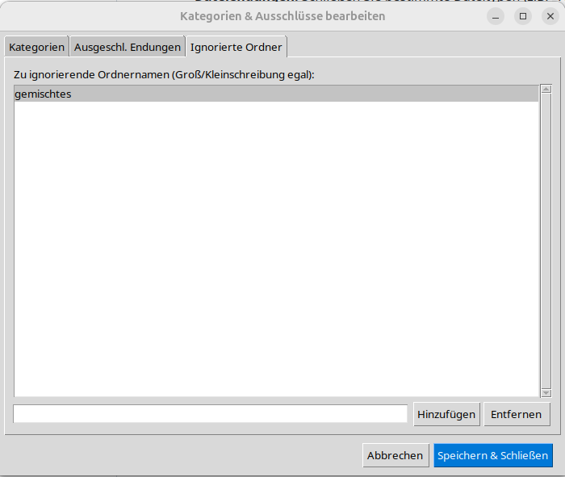
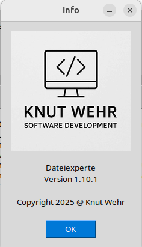

# Dateiexperte

   <br>Ein benutzerfreundliches Python-Programm mit grafischer Oberfläche (GUI) zum Sortieren und Verwalten von Dateien auf Ihrem Computer.

## Beschreibung

Der Dateiexperte hilft Ihnen dabei, Ordnung in Ihren Ordnern zu schaffen. Sie können ein Quellverzeichnis auswählen, und das Programm sortiert die darin enthaltenen Dateien (rekursiv durch alle Unterordner, außer den ausgeschlossenen) basierend auf konfigurierbaren Regeln in ein Zielverzeichnis.

Dabei werden die Dateien in Ordner entsprechend ihrer **Kategorie** (z.B. "Bilder", "Dokumente") einsortiert. Innerhalb dieser Kategorieordner werden automatisch weitere **Unterordner für den spezifischen Dateityp** (z.B. "jpg", "pdf") erstellt. Bestimmte Dateitypen und ganze Ordnernamen können vom Sortiervorgang ausgeschlossen werden. Die Sortieraktion kann als **Kopieren** oder **Verschieben** durchgeführt werden.

## Funktionen

* **Grafische Benutzeroberfläche (GUI):** Intuitive Bedienung über eine mit Python Tkinter erstellte Oberfläche.
* **Mehrsprachigkeit:** Unterstützt aktuell Deutsch, Englisch, Spanisch, Polnisch und Französisch (automatische Spracherkennung basierend auf dem System-Locale, Fallback auf Englisch). Weitere Sprachen können durch Hinzufügen von `.json`-Dateien im `locales`-Ordner ergänzt werden.
* **Quell-/Zielordner-Auswahl:** Bequeme Auswahl der Ordner über Systemdialoge.
* **Kopieren oder Verschieben:** Flexible Wahl der Dateiaktion.
* **Regelbasierte Sortierung:** Ordnet Dateien anhand ihrer Endungen konfigurierbaren Kategorien zu (`sorter_config.json`).
* **Automatische Typ-Unterordner:** Erstellt Unterordner für Dateiendungen innerhalb der Kategorieordner (z.B. `Zielordner/Dokumente/pdf/`, `Zielordner/Bilder/jpg/`).
* **Konfigurierbare Kategorien & Ausschlüsse:** Ein integrierter Editor (Menü "Einstellungen") mit Tabs zur Verwaltung von:
    * Kategorien und deren zugehörigen Dateiendungen.
    * Einer Liste von Dateiendungen, die komplett ignoriert werden sollen.
    * Einer Liste von Ordnernamen, die beim Scannen des Quellordners übersprungen werden.
* **Datei-Informationen:** Zeigt detaillierte Systeminformationen (Pfad, Größe, Änderungsdaten etc.) zu einer beliebigen Datei über das Menü "Bearbeiten" an.
* **Fortschrittsanzeige & Logging:** Visuelles Feedback während des Sortierens und detaillierte Protokollierung im Hauptfenster.
* **Konfigurationsdatei:** Speichert alle Einstellungen (Kategorien, Ausschlüsse) in einer lesbaren `sorter_config.json`-Datei.
* **Plattformunabhängigkeit:** Entwickelt mit Python, sollte auf den gängigen Desktop-Systemen (Linux, Windows, macOS) laufen, auf denen Python 3 und Tkinter verfügbar sind.

## Mehrsprachigkeit / Internationalization

Die Anwendung versucht, die Anzeigesprache basierend auf den Locale-Einstellungen deines Betriebssystems zu erkennen. Aktuell sind Übersetzungen für folgende Sprachen enthalten (über JSON-Dateien im `locales`-Ordner):

* `de.json` (Deutsch)
* `en.json` (Englisch - Fallback-Sprache)
* `es.json` (Spanisch)
* `pl.json` (Polnisch)
* `fr.json` (Französisch)

Wenn deine Systemsprache erkannt wird und eine entsprechende `.json`-Datei existiert, wird diese verwendet. Andernfalls greift die Anwendung auf Englisch (`en.json`) zurück.

Du kannst Übersetzungen verbessern oder neue Sprachen hinzufügen, indem du die entsprechenden `.json`-Dateien im `locales`-Ordner bearbeitest oder erstellst. Die Schlüssel müssen mit denen in `en.json` übereinstimmen.

## Screenshots

  
*Das Hauptfenster der Anwendung.*

  
*Bearbeiten der Kategorien und Dateiendungen.*

  
*Verwaltung der ausgeschlossenen Endungen.*

  
*Verwaltung der ignorierten Ordner.*

  
*Anzeige detaillierter Datei-Informationen.*

## Installation & Setup

**Voraussetzungen:**

* **Python 3:** Version 3.8 oder neuer wird empfohlen. ([python.org](https://www.python.org/))
* **Git:** (Optional, zum Klonen des Repositories) ([git-scm.com](https://git-scm.com/))
* **Pillow:** Python-Bibliothek zur Bildverarbeitung (für das Logo im Info-Fenster).

**Schritte:**

1.  **Repository herunterladen/klonen:**
    ```bash
    git clone [https://github.com/knuwe1/Dateiexperte.git](https://github.com/knuwe1/Dateiexperte.git)
    cd Dateiexperte
    ```
    Oder lade das Projekt als ZIP herunter und entpacke es.

2.  **Virtuelle Umgebung erstellen (Sehr empfohlen!):**
    ```bash
    # Im Projektverzeichnis (Dateiexperte)
    python3 -m venv .venv
    source .venv/bin/activate   # Linux/macOS
    # .\venv\Scripts\activate  # Windows (cmd/powershell)
    ```

3.  **Abhängigkeiten installieren:**
    Stelle sicher, dass Pillow installiert ist. Erstelle optional eine `requirements.txt`-Datei mit folgendem Inhalt:
    ```txt
    Pillow
    ```
    Und installiere sie dann (innerhalb der aktivierten venv):
    ```bash
    pip install -r requirements.txt
    # Oder direkt:
    # pip install Pillow
    ```

4.  **Dateien prüfen:**
    * Das Skript `main.py` muss vorhanden sein.
    * Der Ordner `img` mit der Datei `logo.jpg` muss vorhanden sein.
    * Der Ordner `locales` mit den `.json`-Sprachdateien muss vorhanden sein.

5.  **Konfigurationsdatei (`sorter_config.json`):**
    * Wird beim ersten Start automatisch mit Standardwerten erstellt, falls nicht vorhanden. Kann danach manuell oder über die GUI angepasst werden.

## Benutzung

1.  **Starten:**
    * Öffne ein Terminal/eine Kommandozeile.
    * Navigiere in das Projektverzeichnis (`Dateiexperte`).
    * Aktiviere die virtuelle Umgebung (falls erstellt): `source .venv/bin/activate` (oder Windows-Äquivalent).
    * Führe das Skript aus:
        ```bash
        python3 main.py
        ```

2.  **Bedienung:**
    * Wähle Quell- und Zielordner.
    * Wähle die Aktion (Kopieren/Verschieben).
    * Klicke auf "Sortieren starten".
    * Beobachte den Fortschritt und das Log im unteren Bereich.
    * Nutze die Menüeinträge für weitere Funktionen (Datei-Info, Einstellungen).

## Konfiguration (`sorter_config.json`)

Die Einstellungen werden in dieser JSON-Datei gespeichert:

* **`"Kategorien"`:** Objekt mit Kategorienamen als Schlüssel und Listen von zugehörigen Dateiendungen (mit Punkt, z.B. `".jpg"`) als Werte.
* **`"StandardKategorie"`:** Name des Ordners für nicht zugeordnete Dateien (z.B. `"_Unsortiert"`).
* **`"AusgeschlosseneEndungen"`:** Liste von Dateiendungen (mit Punkt, Kleinschreibung empfohlen), die ignoriert werden.
* **`"AusgeschlosseneOrdner"`:** Liste von Ordnernamen (Kleinschreibung empfohlen), die beim Scannen ignoriert werden.

## Beitragen (Contributing)

Fehler gefunden oder Verbesserungsvorschläge? Erstelle gerne ein "Issue" auf der GitHub-Seite des Projekts.

## Lizenz

Dieses Projekt steht unter der MIT-Lizenz. (Füge hier ggf. einen Link zur `LICENSE`-Datei im Repository hinzu: `[MIT-Lizenz](LICENSE)`)

## Autor

Knut Wehr